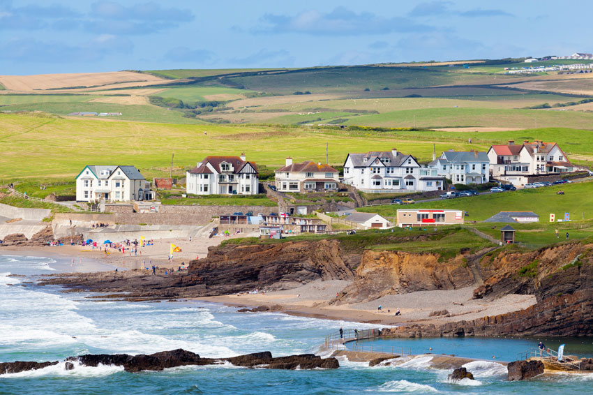
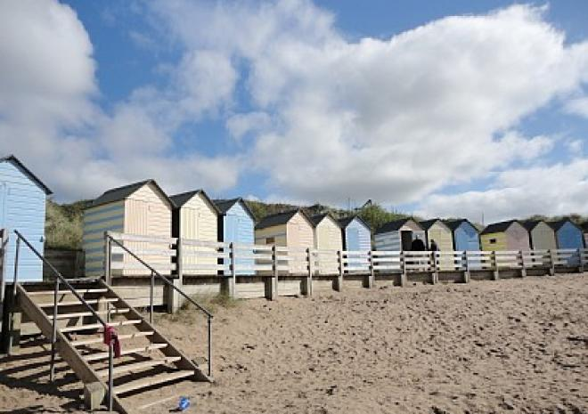
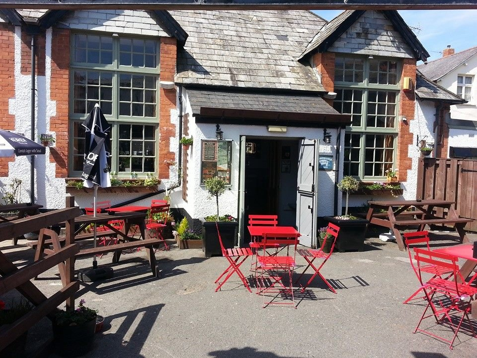
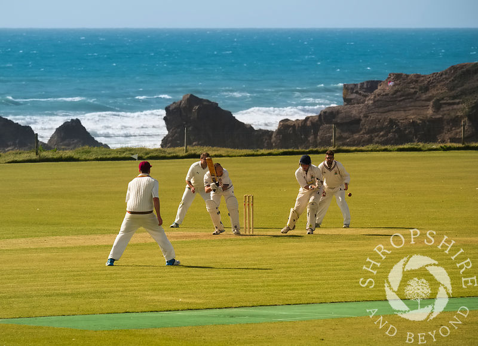
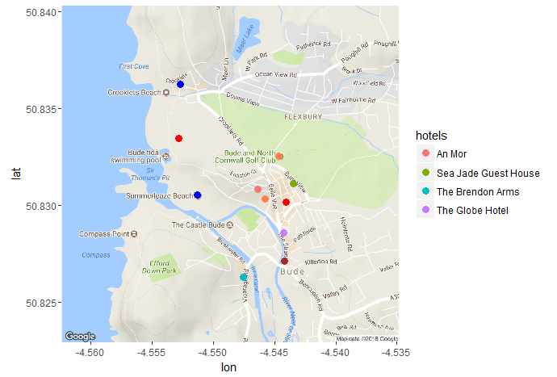
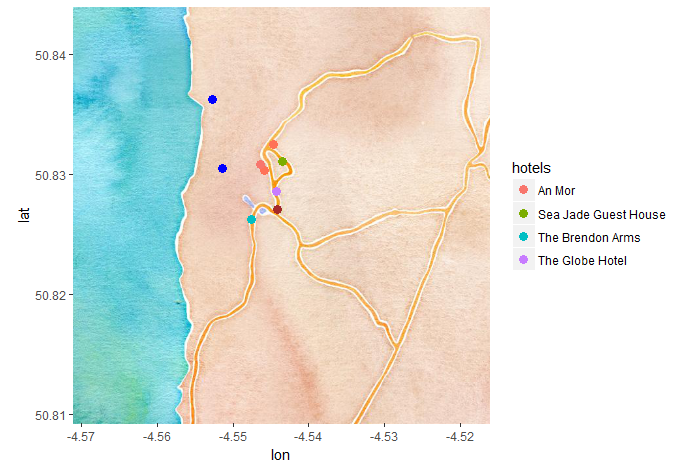
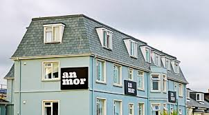
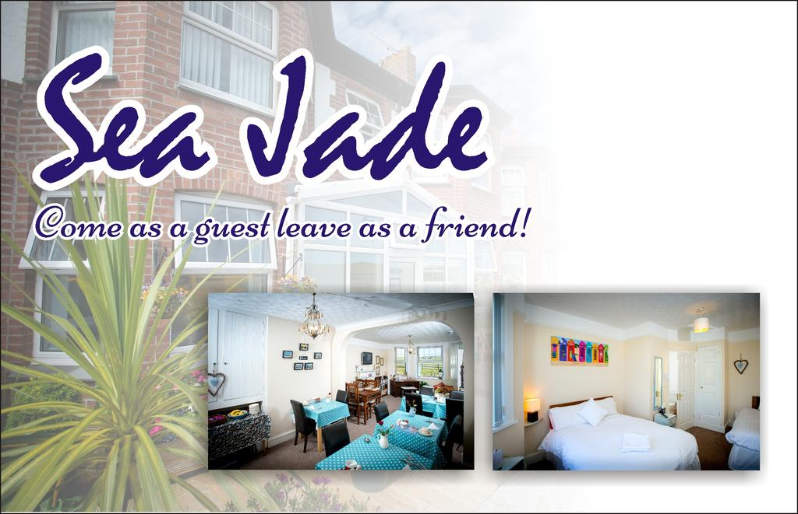
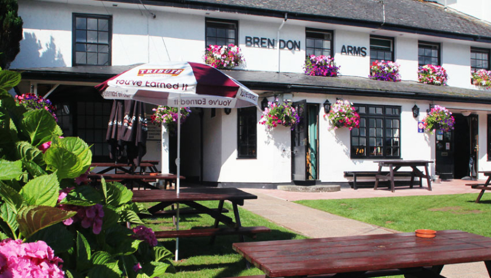
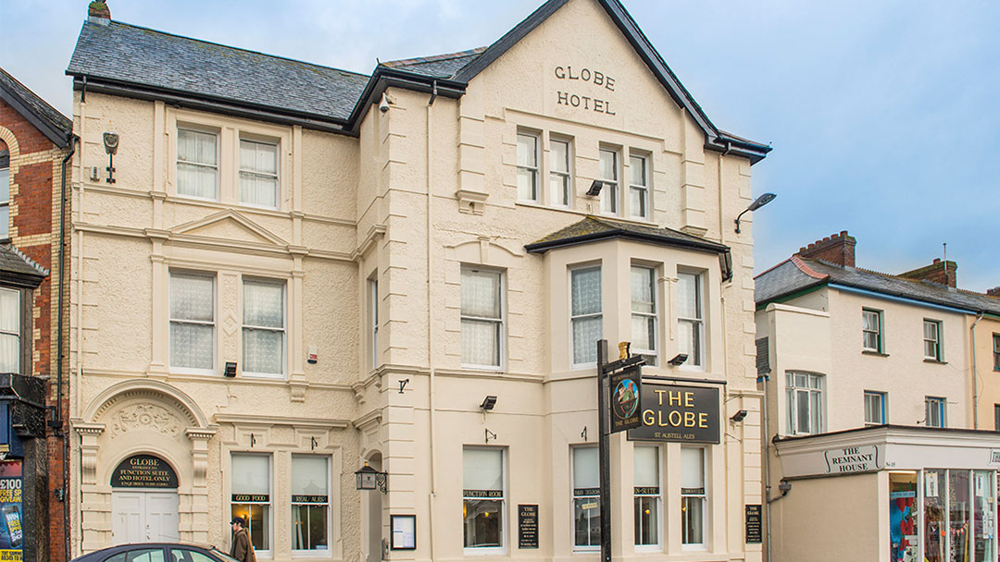

```{r setup, include=FALSE}
knitr::opts_chunk$set(echo = TRUE)
library(ggmap)
library(tidyverse)
```

## Road Map and Vacation Spots in Bude, UK
```{r map1, message=FALSE, warning=FALSE,echo=FALSE}
load("hw6data.RData")
bude <- data.frame('lon'=-4.543678, 'lat'=50.82664)
#map <- get_map("bude, england", zoom= 15)
#beaches
##Summerleaze Beach, Bude, UK
sb <- data.frame('lon'=-4.551349,'lat'=50.83054)
##Crooklets Beach, Bude, UK
cb <- data.frame('lon'=-4.552731,'lat'=50.83626)

#vacation spots
##Bude and North Cornwall Golf Club, Bude, UK
golf <- data.frame('lon'=-4.544649,'lat'=50.83256)
##Adventure International, Bude, UK
ai <- data.frame('lon'=-4.545798,'lat'=50.83035)
##Bude North Cornwall Cricket Club, bude, uk
cricket <- data.frame('lon'=-4.552814,'lat'=50.83347)
#Bar 35, Bude, UK
pub <- data.frame('lon'=-4.544088,'lat'=50.83016)

#road map
map <- get_map(bude+c(-0.005,0.005),zoom=15)    ##modify the map location to adjust the view

ggmap(map) +
  geom_point(
    aes(x = lon, y = lat),
    data = bude+c(-0.0005,0.0005), color = "brown", size = 3
  ) +
  geom_point(
    aes(x = lon, y = lat),
    data = sb, color = "blue", size = 3
  ) +
  geom_point(
    aes(x = lon, y = lat),
    data = cb, color = "blue", size = 3
  ) +
  geom_point(
    aes(x = lon, y = lat),
    data = golf, color = "coral", size = 3
  ) +
  geom_point(
    aes(x = lon, y = lat),
    data = ai, color = "coral", size = 3
  ) +
  geom_point(
    aes(x = lon, y = lat),
    data = cricket, color = "red", size = 3
  ) +
  geom_point(
    aes(x = lon, y = lat),
    data = pub, color = "red", size = 3
  ) +  
  geom_path(
    aes(x = lon, y = lat), colour = "red", size = 1.5,
    data = route_df, lineend = "round"
  ) +  
  geom_text(
    aes(x = lon, y = lat, label = "Summerleaze Beach"), size =2, 
    data = sb, vjust = -0.8, hjust = 0.5
  ) +
  geom_text(
    aes(x = lon, y = lat, label = "Crooklets Beach"), size =2, 
    data = cb, vjust = -0.8, hjust = 0.5
  ) +
  geom_text(
    aes(x = lon, y = lat, label = "Bude and North Cornwall Golf Club"), size =2, 
    data = golf, vjust = -0.8, hjust = 0.5
  ) +  
  geom_text(
    aes(x = lon, y = lat, label = "Adventure International"), size =2, 
    data = ai, vjust = -1.0, hjust = 0.5
  ) +
  geom_text(
    aes(x = lon, y = lat, label = "BAR35"), size =2, 
    data = pub, vjust = -0.5, hjust = 0.5
  ) +
  geom_text(
    aes(x = lon, y = lat, label = "Bude North Cornwall Cricket Club"), size =2, 
    data = cricket, vjust = -0.8, hjust = 0.5
  )

#watercolor map
# map1 <- get_map("bude,uk",zoom=14,maptype = "watercolor")
```

####Beaches:
Marked with blue points (Summerleaze Beach and Crooklets Beach).  
  

{width=40%}   {width=40% }  

 
**Summerleaze Beach (left) and Crooklets Beach (right) **  
  
####Vacation spots:
Marked with coral points (Bude and North Cornwall Golf Club and Adventure International).  
  
{width=60%}
    {width=50%}  
**Bude and North Cornwall Golf Club (left) and Adventure International (right)**  
  
  
####Route 
In the road map, the pub (Bar 35) and Bude North Cornwall Cricket Club are marked with red points. The red path shows the route between them.  
  
{width=65%}
{width=120%}  
**Bar35 (left) and North Corwall Cricket Club (right)**  
  
  
## Watercolor Map
  
Here is the watercolor map with the same marked locations:  
  

```{r map2, message=FALSE, warning=FALSE,echo=FALSE}
ggmap(map1) +
  geom_point(
    aes(x = lon, y = lat),
    data = bude+c(-0.0005,0.0005), color = "brown", size = 3
  ) +
  geom_point(
    aes(x = lon, y = lat),
    data = sb, color = "blue", size = 3
  ) +
  geom_point(
    aes(x = lon, y = lat),
    data = cb, color = "blue", size = 3
  ) +
  geom_point(
    aes(x = lon, y = lat),
    data = golf, color = "coral1", size = 3
  ) +
  geom_point(
    aes(x = lon, y = lat),
    data = ai, color = "coral1", size = 3
  ) + 
  geom_point(
    aes(x = lon, y = lat),
    data = cricket, color = "red", size = 3
  ) +
  geom_point(
    aes(x = lon, y = lat),
    data = pub, color = "red", size = 3
  ) +
  geom_text(
    aes(x = lon, y = lat, label = "Summerleaze Beach"), size =2, 
    data = sb, vjust = -0.8, hjust = 0.5
  ) +
  geom_text(
    aes(x = lon, y = lat, label = "Crooklets Beach"), size =2, 
    data = cb, vjust = -0.8, hjust = 0.5
  ) +
  geom_text(
    aes(x = lon, y = lat, label = "Bude and North Cornwall Golf Club"), size =2, 
    data = golf, vjust = -0.8, hjust = 0.5
  ) +  
  geom_text(
    aes(x = lon, y = lat, label = "Adventure International"), size =2, 
    data = ai, vjust = -2.5, hjust = 0.5
  ) +
  geom_text(
    aes(x = lon, y = lat, label = "BAR35"), size =2, 
    data = pub, vjust = -0.8, hjust = 0.5
  ) +
  geom_text(
    aes(x = lon, y = lat, label = "Bude North Cornwall Cricket Club"), size =2, 
    data = cricket, vjust = -0.8, hjust = 0.5
  )
```

Eventually, here the maps updated from Francesco Ignazio Re as the second part of the assignment, showing a few hotels of the area along with their names.


{width=65%} {width=65%}


Below, the pictures of the hotels displayed in the map:


{width=50%} {width=50%}

{width=50%} {width=50%}


####First figure: Hotel An Mor
####Second figure: Sea Jade Guest House
####Third figure: The Brendon Arms
####Fourth figure: The Globe Hotel

